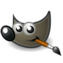
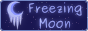

**"We all die. The goal isn't to live forever. The goal is to create something that will."** *Chuck Palahniuk*

### Intro

<b>Ancient Beast</b> is a turn based strategy indie game project, played online against other people, featuring a wide variety of creatures to acquire and items to equip onto, putting them to use in order to defeat your opponents. This project was carefully designed to be easy to learn, fun to play and hard to master. We hope you'll enjoy it!

Ancient Beast is <a href="https://mega.co.nz/#F!GAJAjAzL!AhBUayQndZbH_j2IL2B-nA" target="_blank">free</a>, <a href="https://github.com/FreezingMoon/AncientBeast" target="_blank">open source</a> and developed by <a href="http://www.FreezingMoon.org" target="_blank" class="FM"><b>Freezing Moon</b></a> (and community). It uses web languages such as HTML, PHP and JavaScript, so that it's playable from any modern browser without the need of plugins.

### Tools

The project is developed with the use of free open source cross platform applications and freeware services.
<a href="https://mega.co.nz/#F!GAJAjAzL!AhBUayQndZbH_j2IL2B-nA" target="_blank"><b>Mega</b></a> comes in very handy when working on the game assets collaboratively, while <a href="https://github.com/FreezingMoon/AncientBeast" target="_blank"><b>Github</b></a> handles the code part and stores the final assets. Art contributions can be made as well in our <a href="http://Ancient-Beast.deviantart.com" target="_blank"><b>deviantArt</b></a> group. There is no centralized forum, but you can use the various Disqus widgets around the website, our <a href="https://github.com/FreezingMoon/AncientBeast/issues" target="_blank"><b>Github issue tracker</b></a> or our <a href="http://forum.freegamedev.net/viewforum.php?f=70" target="_blank"><b>FreeGameDev subforum</b></a>. 
<a href="http://blender.org" target="_blank"><b>Blender</b></a> is being used for creating most of the assets, such as combat locations, creatures and their own animations, which are rendered into sprites that are usually made into sprite-sheets as well as for other tasks. 
<a href="http://krita.org" target="_blank"><b>Krita</b></a>, <a href="http://gimp.org" target="_blank"><b>Gimp</b></a> and <a href="http://mypaint.intilinux.com" target="_blank"><b>MyPaint</b></a> are useful for concept art, while <a href="http://inkscape.org" target="_blank"><b>Inkscape</b></a> is useful for creating vector ability icons.

<table style="font-size: 18px; font-weight: bold; margin: 0; padding: 0; margin-left: auto; margin-right: auto; text-align: center;">
<tr align="center">
	<td><a href="https://mega.co.nz/#F!GAJAjAzL!AhBUayQndZbH_j2IL2B-nA" target="_blank">Mega</a></td>
	<td><a href="http://Ancient-Beast.deviantart.com" target="_blank">deviantArt</a></td>
	<td><a href="http://blender.org" target="_blank">Blender</a></td>
	<td><a href="http://krita.org" target="_blank">Krita</a></td>
	<td><a href="http://gimp.org" target="_blank">Gimp</a></td>
	<td><a href="http://mypaint.intilinux.com" target="_blank">Mypaint</a></td>
	<td><a href="http://inkscape.org" target="_blank">Inkscape</a></td>
</tr>
</table>

### License
<table border=1 width=100%>
<tr>
	<td></td>
	<td>Ancient Beast name and logo are trademarks of Freezing Moon. Respect the developers and their work!</td>
</tr>
<tr>
	<td></td>
	<td><a href="http://creativecommons.org/licenses/by-sa/3.0" target="_blank">CC-BY-SA 3.0</a>: Artwork and audio can be remixed and shared under the same license, provided you credit and link the project, as well as the author(s) of the respective works.</td>
</tr>
<tr>
	<td></td>
	<td><a href="http://www.gnu.org/licenses/agpl-3.0.html" target="_blank">AGPL 3.0</a>: The codebase or parts of it can be remixed and shared under the same license, provided you credit and link the project.</td>
</tr>
</table>

### Contribute

There are various ways in which you can help out the project. Check out the <a href="https://ancientbeast.com/contribute" target="_blank">"Make Your Contribution"</a> guide and get it going! 
In case you want to beta test and even patch the <a href="https://github.com/FreezingMoon/AncientBeast/tree/master/development">development version</a> of the game, dive right in by following this <a href="https://github.com/FreezingMoon/AncientBeast/tree/master/development/#readme">quick guide</a>.

